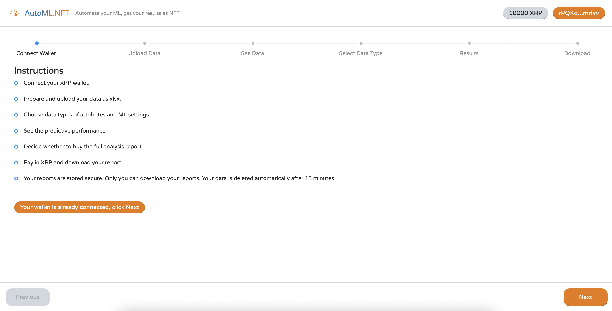
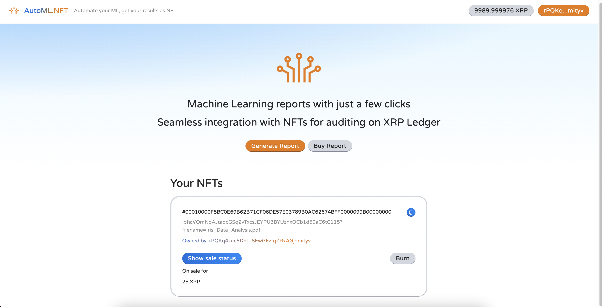

 

## Automate your ML, get your results as NFT

Welcome to the home page of the AutoML.NFT dapp.

<hline>
</hline>

## Start Here:

- [**AutoML.NFT Dapp**](https://lucid-mayer-4a70a5.netlify.app/) is running live on the cloud.
- [**Sample "restaurant" dataset**](https://www.dropbox.com/s/5q61bqr136m52sf/dataset.xlsx?dl=0) can be used to test the dapp. Under Role, role for "RestaurantID" should be "Id" and role for "Satisfaction" should be "Target".
- [**Documentation**](./doc/Documentation.md) describes the project and the dapp.
- [**YouTube Video**](https://youtu.be/CwoCla53aFI) is the demo video for the hackathon.


## Executive Summary
  
[AutoML.NFT app](https://github.com/albert-vo-crypto/automlnft) is 
- **a Machine Learning as a Service (MLaaS) platform** to 
- interactively and dynamically **generate Machine Learning (ML) report** for uploaded data files, and 
- **issue NFT tokens** on the [XRP Ledger](https://xrpl.org/index.html) as certificate of ownership. 
AutoMLNFT also provides an analytical marketplace, where legal ownership of ML reports can be bought. The project also provides a template for XRPL and other blockchains on how MLaaS dapps with innovative features can be developed on the blockchain.

The app was designed, developed, and implemented during the period of [XRPL NFT Hackathon](https://xrplnft.devpost.com/) by the project team. 

The documentation herein describes the application and presents a blue print of how the system can be developed into the future over an extended time period. 

## AutoML.NFT Screenshots





## AutoML.NFT Team

- [Albert Vo](https://github.com/albert-vo-crypto/) (Backend development, Smart contracts, System design)

_San Fransisco, CA, USA_

- [Orhun Ozer](https://github.com/zhunor) (Frontend development, Smart contracts, UI design)

_Istanbul, Turkey_

- [Oguzhan Ozer](https://github.com/oguzhanoozer) (ML Engine development, Algorithm design)

_Ankara, Turkey_

- [Gurdal Ertek](https://github.com/gurdalertek) (System design, UI design, Algorithm design, System documentation)

_Al Ain, United Arab Emirates_

<!--- Member of [BlockBlockData](https://blockblockdata.com) Team; Associate Professor of Business Analytics, [UAE University](https://cbe.uaeu.ac.ae/en/departments/analytics/) --->

# Vite + React + Typescript + Eslint + Prettier

A starter for React with Typescript with the fast Vite and all static code testing with Eslint and formatting with Prettier.


We found out about Vite and wanted to have a boilerplate for the technologies that we used. You can find more about these in the following links: 
- [Vite](https://github.com/vitejs/vite) 
- [React](https://reactjs.org/)
- [Typescript](https://www.typescriptlang.org/)
- [Eslint](https://eslint.org/)
- [Prettier](https://prettier.io/)

## Installation

Clone the repo and run `yarn install`

## Start

After the successfull installation of the packages: `yarn dev`


## AUTOML Install


``` bash
wget https://repo.anaconda.com/archive/Anaconda3-2021.05-Linux-x86_64.sh
chmod +x Anaconda3-2021.05-Linux-x86_64.sh
run Anaconda3-2021.05-Linux-x86_64.sh
```

### Install python packages
``` bash
conda install seaborn
conda install missingno
conda install xelatex
conda install Flask
```
