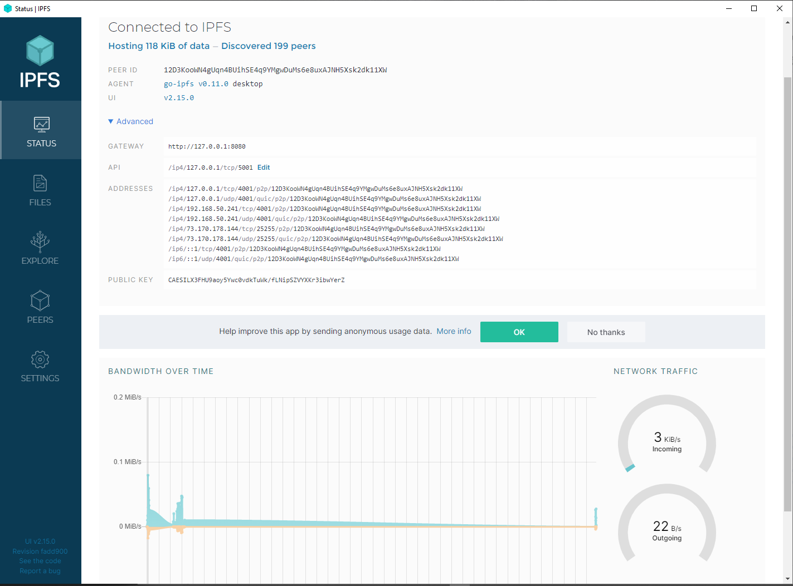
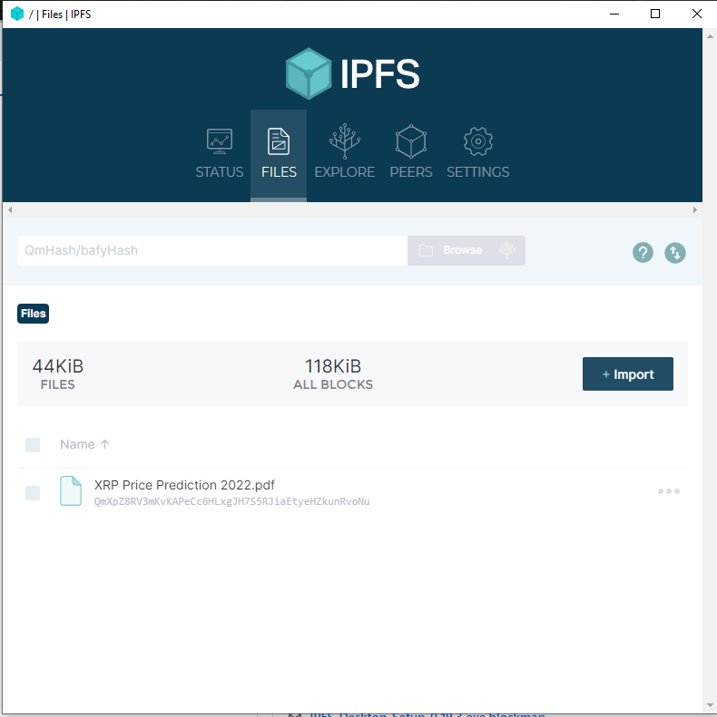
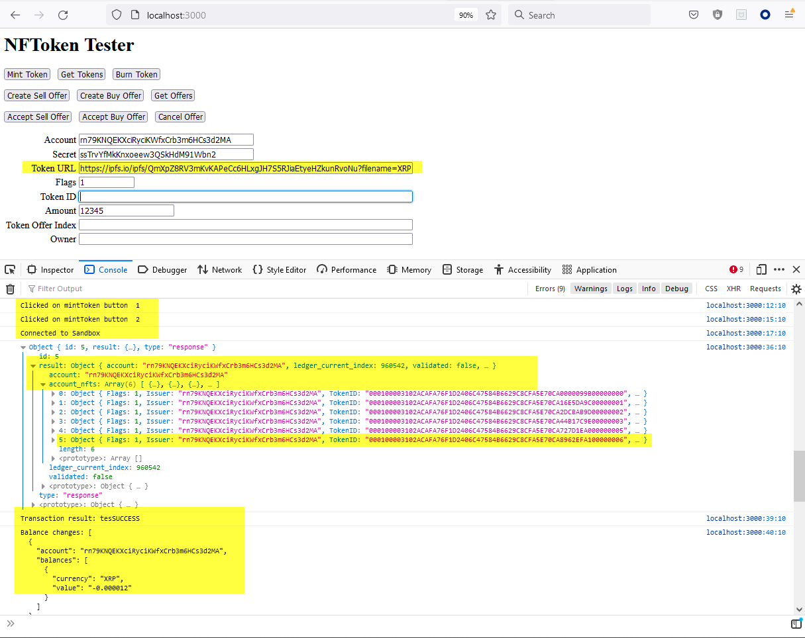
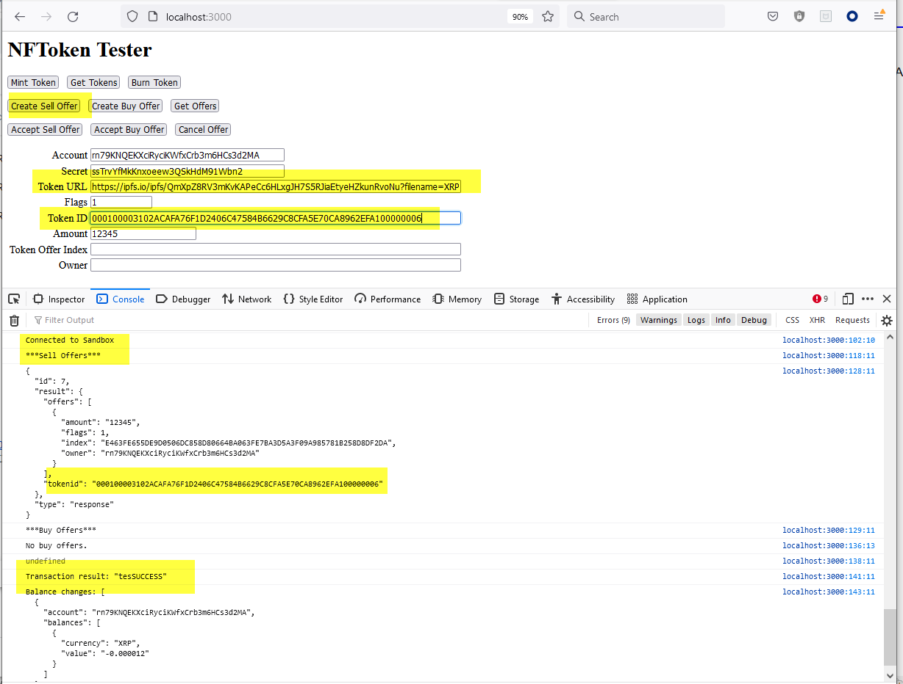
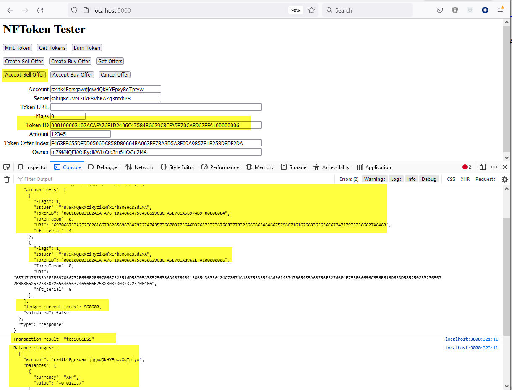

 

## Backend 

Here are tested functionalities of **smart contracts** for transactions:
1.  Connect to Testnet
2.  Get Credentials
3.  Configure Issuer (cold address) setting
4.  Configure hot address setting
5.  Creat trust line from hot to cold address
6.  Send token FOO
7.  Check balances

Here are tested functionalities related to **IPFS and NFT minting**:

1.  Create IPFS
2.  Create XRPL Price Prediction Report
3.  Mint NFT ( Non Fungible Token:  Proof of Ownership)
4.  Create Sell Offer
5.  Accept Sell Offer
6.  Complete NFT transaction successfully

## Smart Contracts for Transactions 

Below, sample output from console are provided for **smart contracts** for transactions:

### Funding from Faucet
    vscode ➜ /workspaces/vscode-remote-try-python/CRYPTO2022/xrpl-py (master ✗) $ python issue-token.py
    # Getting 2 new accounts from the Testnet faucet...
    Attempting to fund address r9WRuv4gPyxyM9PEvHWAieTTYyPxwTY6NE
    Faucet fund successful.
    Attempting to fund address rnh6XjKC5rNmxnQjLoe3ErWmnHtKdq4adS
    Faucet fund successful.

### Sending cold address AccountSet transaction
    Response(status=<ResponseStatus.SUCCESS: 'success'>, result={'Account': 'r9WRuv4gPyxyM9PEvHWAieTTYyPxwTY6NE', 'Domain': '6578616D706C652E636F6D', 'Fee': '10', 'Flags': 0, 'LastLedgerSequence': 25213827, 'Sequence': 25213804, 'SetFlag': 8, 'SigningPubKey': 'ED525F36CDCCD619B63AD1C27624EF98C0B48C40F6B5E5CC26BCDBEFD62DA7CB2F', 'TickSize': 5, 'TransactionType': 'AccountSet', 'TransferRate': 0, 'TxnSignature': '3BCE0CA3201145082C25A0A8419A9C5CB8AA65A45EDB119E6CB74343C57C5F059421E7B71B110D278FFCF0C5C4D8D7EEDD7C5270E4BD50A1DDB81450F8DFA30A', 'date': 697939552, 'hash': '6B6C0CCF608E83CFFA561CF35F42186378EED36A3C5B8FA47A5B16F8790BB562', 'inLedger': 25213809, 'ledger_index': 25213809, 'meta': {'AffectedNodes': [{'ModifiedNode': {'FinalFields': {'Account': 'r9WRuv4gPyxyM9PEvHWAieTTYyPxwTY6NE', 'Balance': '999999990', 'Domain': '6578616D706C652E636F6D', 'Flags': 8388608, 'OwnerCount': 0, 'Sequence': 25213805, 'TickSize': 5}, 'LedgerEntryType': 'AccountRoot', 'LedgerIndex': '11766F586E42CBF82C02B9409A23B30348947733B3891FA2B33F0630D3FD7C24', 'PreviousFields': {'Balance': '1000000000', 'Flags': 0, 'Sequence': 25213804}, 'PreviousTxnID': '047A6165FE511ACE100EB028313E7F10FED101EB6EFC049D3A4066F05AE9D0D5', 'PreviousTxnLgrSeq': 25213804}}], 'TransactionIndex': 0, 'TransactionResult': 'tesSUCCESS'}, 'validated': True}, id=None, type=<ResponseType.RESPONSE: 'response'>)

### Sending hot address AccountSet transaction
    Response(status=<ResponseStatus.SUCCESS: 'success'>, result={'Account': 'rnh6XjKC5rNmxnQjLoe3ErWmnHtKdq4adS', 'Fee': '10', 'Flags': 0, 'LastLedgerSequence': 25213829, 'Sequence': 25213807, 'SetFlag': 2, 'SigningPubKey': 'EDF031ECAE632347FF4B2C29636A2BC8C041928F8FA783F48224085967632C436D', 'TransactionType': 'AccountSet', 'TxnSignature': '04C6C6627DB25E667DCC6EB5029EEDA2F0616B7949F554DD5757B3270284E210D7F7F70B2890795099F62697C046C972208BCECDE333A1F625F4AA5DB453250D', 'date': 697939561, 'hash': '545F9832676FE7575BB042ADD5F8DABBD6478212E27A886209EA7CADC7E374AF', 'inLedger': 25213811, 'ledger_index': 25213811, 'meta': {'AffectedNodes': [{'ModifiedNode': {'FinalFields': {'Account': 'rnh6XjKC5rNmxnQjLoe3ErWmnHtKdq4adS', 'Balance': '999999990', 'Flags': 262144, 'OwnerCount': 0, 'Sequence': 25213808}, 'LedgerEntryType': 'AccountRoot', 'LedgerIndex': '9226E752691A10B62C6326BA143930EB65E9C6A3EEB648255E2B7AE9F067A247', 'PreviousFields': {'Balance': '1000000000', 'Flags': 0, 'Sequence': 25213807}, 'PreviousTxnID': '980DD38665AFB1C288F4C847E2445A74FF5864195B67BEB4E04853C882EB80A8', 'PreviousTxnLgrSeq': 25213807}}], 'TransactionIndex': 1, 'TransactionResult': 'tesSUCCESS'}, 'validated': True}, id=None, type=<ResponseType.RESPONSE: 'response'>)

### Creating trust line from hot address to issuer
    Response(status=<ResponseStatus.SUCCESS: 'success'>, result={'Account': 'rnh6XjKC5rNmxnQjLoe3ErWmnHtKdq4adS', 'Fee': '10', 'Flags': 0, 'LastLedgerSequence': 25213831, 'LimitAmount': {'currency': 'FOO', 'issuer': 'r9WRuv4gPyxyM9PEvHWAieTTYyPxwTY6NE', 'value': '10000000000'}, 'Sequence': 25213808, 'SigningPubKey': 'EDF031ECAE632347FF4B2C29636A2BC8C041928F8FA783F48224085967632C436D', 'TransactionType': 'TrustSet', 'TxnSignature': '7F7CEB346E9B0967BF36A48B2223AA07FE1839EA915AB7309104640C4EB14BD269FD6F889E0CCD660933A887E1E2DEE6C19D7ABF809DA05B1639B878F46DEA0D', 'date': 697939570, 'hash': '26945C62A14B52F76F3242171D1A57D2E771D12CDB4CB6227BEF4CC2BB071D6C', 'inLedger': 25213813, 'ledger_index': 25213813, 'meta': {'AffectedNodes': [{'ModifiedNode': {'LedgerEntryType': 'AccountRoot', 'LedgerIndex': '11766F586E42CBF82C02B9409A23B30348947733B3891FA2B33F0630D3FD7C24', 'PreviousTxnID': '6B6C0CCF608E83CFFA561CF35F42186378EED36A3C5B8FA47A5B16F8790BB562', 'PreviousTxnLgrSeq': 25213809}}, {'CreatedNode': {'LedgerEntryType': 'RippleState', 'LedgerIndex': '77D7E405897111F1C0E342270B1A452EBD03831129BAC73B867C971C8476F454', 'NewFields': {'Balance': {'currency': 'FOO', 'issuer': 'rrrrrrrrrrrrrrrrrrrrBZbvji', 'value': '0'}, 'Flags': 65536, 'HighLimit': {'currency': 'FOO', 'issuer': 'r9WRuv4gPyxyM9PEvHWAieTTYyPxwTY6NE', 'value': '0'}, 'LowLimit': {'currency': 'FOO', 'issuer': 'rnh6XjKC5rNmxnQjLoe3ErWmnHtKdq4adS', 'value': '10000000000'}}}}, {'CreatedNode': {'LedgerEntryType': 'DirectoryNode', 'LedgerIndex': '782F021EE054CAA7CADA93A39CCB066B83BB0F5368958F735B9565B0DA185F3F', 'NewFields': {'Owner': 'r9WRuv4gPyxyM9PEvHWAieTTYyPxwTY6NE', 'RootIndex': '782F021EE054CAA7CADA93A39CCB066B83BB0F5368958F735B9565B0DA185F3F'}}}, {'ModifiedNode': {'FinalFields': {'Account': 'rnh6XjKC5rNmxnQjLoe3ErWmnHtKdq4adS', 'Balance': '999999980', 'Flags': 262144, 'OwnerCount': 1, 'Sequence': 25213809}, 'LedgerEntryType': 'AccountRoot', 'LedgerIndex': '9226E752691A10B62C6326BA143930EB65E9C6A3EEB648255E2B7AE9F067A247', 'PreviousFields': {'Balance': '999999990', 'OwnerCount': 0, 'Sequence': 25213808}, 'PreviousTxnID': '545F9832676FE7575BB042ADD5F8DABBD6478212E27A886209EA7CADC7E374AF', 'PreviousTxnLgrSeq': 25213811}}, {'CreatedNode': {'LedgerEntryType': 'DirectoryNode', 'LedgerIndex': 'BDD3A02065C3EE0610825B3BB36AC519297714D296BB427FB53D082C47BD31A7', 'NewFields': {'Owner': 'rnh6XjKC5rNmxnQjLoe3ErWmnHtKdq4adS', 'RootIndex': 'BDD3A02065C3EE0610825B3BB36AC519297714D296BB427FB53D082C47BD31A7'}}}], 'TransactionIndex': 1, 'TransactionResult': 'tesSUCCESS'}, 'validated': True}, id=None, type=<ResponseType.RESPONSE: 'response'>)

### Sending 3840 FOO to rnh6XjKC5rNmxnQjLoe3ErWmnHtKdq4adS...
    Response(status=<ResponseStatus.SUCCESS: 'success'>, result={'Account': 'r9WRuv4gPyxyM9PEvHWAieTTYyPxwTY6NE', 'Amount': {'currency': 'FOO', 'issuer': 'r9WRuv4gPyxyM9PEvHWAieTTYyPxwTY6NE', 'value': '3840'}, 'Destination': 'rnh6XjKC5rNmxnQjLoe3ErWmnHtKdq4adS', 'Fee': '10', 'Flags': 0, 'LastLedgerSequence': 25213837, 'Sequence': 25213805, 'SigningPubKey': 'ED525F36CDCCD619B63AD1C27624EF98C0B48C40F6B5E5CC26BCDBEFD62DA7CB2F', 'TransactionType': 'Payment', 'TxnSignature': '595D06E2151BA6BCBB83524AA832412E06732D71C4868E458AF6D397C48E09612E15EC394B61E4DD2020A480929A287745D3009A686174712B7C82927AD00400', 'date': 697939582, 'hash': '857844377949A833D697664A29DF03C95CC78E3FA81AD4A4447895B87CCB3A9C', 'inLedger': 25213819, 'ledger_index': 25213819, 'meta': {'AffectedNodes': [{'ModifiedNode': {'FinalFields': {'Account': 'r9WRuv4gPyxyM9PEvHWAieTTYyPxwTY6NE', 'Balance': '999999980', 'Domain': '6578616D706C652E636F6D', 'Flags': 8388608, 'OwnerCount': 0, 'Sequence': 25213806, 'TickSize': 5}, 'LedgerEntryType': 'AccountRoot', 'LedgerIndex': '11766F586E42CBF82C02B9409A23B30348947733B3891FA2B33F0630D3FD7C24', 'PreviousFields': {'Balance': '999999990', 'Sequence': 25213805}, 'PreviousTxnID': '26945C62A14B52F76F3242171D1A57D2E771D12CDB4CB6227BEF4CC2BB071D6C', 'PreviousTxnLgrSeq': 25213813}}, {'ModifiedNode': {'FinalFields': {'Balance': {'currency': 'FOO', 'issuer': 'rrrrrrrrrrrrrrrrrrrrBZbvji', 'value': '3840'}, 'Flags': 65536, 'HighLimit': {'currency': 'FOO', 'issuer': 'r9WRuv4gPyxyM9PEvHWAieTTYyPxwTY6NE', 'value': '0'}, 'HighNode': '0', 'LowLimit': {'currency': 'FOO', 'issuer': 'rnh6XjKC5rNmxnQjLoe3ErWmnHtKdq4adS', 'value': '10000000000'}, 'LowNode': '0'}, 'LedgerEntryType': 'RippleState', 'LedgerIndex': '77D7E405897111F1C0E342270B1A452EBD03831129BAC73B867C971C8476F454', 'PreviousFields': {'Balance': {'currency': 'FOO', 'issuer': 'rrrrrrrrrrrrrrrrrrrrBZbvji', 'value': '0'}}, 'PreviousTxnID': '26945C62A14B52F76F3242171D1A57D2E771D12CDB4CB6227BEF4CC2BB071D6C', 'PreviousTxnLgrSeq': 25213813}}], 'TransactionIndex': 1, 'TransactionResult': 'tesSUCCESS', 'delivered_amount': {'currency': 'FOO', 'issuer': 'r9WRuv4gPyxyM9PEvHWAieTTYyPxwTY6NE', 'value': '3840'}}, 'validated': True}, id=None, type=<ResponseType.RESPONSE: 'response'>)

### Getting hot address balances
    Response(status=<ResponseStatus.SUCCESS: 'success'>, result={'account': 'rnh6XjKC5rNmxnQjLoe3ErWmnHtKdq4adS', 'ledger_hash': '8F263858489796E4A7E16B971D08E705005C86F913D61C3BC846A0558E948D31', 'ledger_index': 25213819, 'lines': [{'account': 'r9WRuv4gPyxyM9PEvHWAieTTYyPxwTY6NE', 'balance': '3840', 'currency': 'FOO', 'limit': '10000000000', 'limit_peer': '0', 'no_ripple': False, 'no_ripple_peer': False, 'quality_in': 0, 'quality_out': 0}], 'validated': True}, id=None, type=<ResponseType.RESPONSE: 'response'>)

### Getting cold address balances
    Response(status=<ResponseStatus.SUCCESS: 'success'>, result={'account': 'r9WRuv4gPyxyM9PEvHWAieTTYyPxwTY6NE', 'balances': {'rnh6XjKC5rNmxnQjLoe3ErWmnHtKdq4adS': [{'currency': 'FOO', 'value': '3840'}]}, 'ledger_hash': '8F263858489796E4A7E16B971D08E705005C86F913D61C3BC846A0558E948D31', 'ledger_index': 25213819, 'validated': True}, id=None, type=<ResponseType.RESPONSE: 'response'>)
    
    
## Smart Contracts for Transactions 

Below, sample output from console are provided for **IPFS and NFT minting**:

### Successfully Create IPFS File System

### Successfully Generate ML Prediction Report (PDF file)

### Successfully Mint Token of IPFS PDF Report

Clicked on mintToken button 1 localhost:3000:12:10
Clicked on mintToken button 2 localhost:3000:15:10
Connected to Sandbox localhost:3000:17:10
Object { id: 5, result: {…}, type: "response" }
id: 5
result: Object { account: "rn79KNQEKXciRyciKWfxCrb3m6HCs3d2MA", ledger_current_index: 960542, validated: false, … }
account: "rn79KNQEKXciRyciKWfxCrb3m6HCs3d2MA"
account_nfts: Array(6) [ {…}, {…}, {…}, … ]
0: Object { Flags: 1, Issuer: "rn79KNQEKXciRyciKWfxCrb3m6HCs3d2MA", TokenID: "000100003102ACAFA76F1D2406C47584B6629C8CFA5E70CA0000099B00000000", … }
1: Object { Flags: 1, Issuer: "rn79KNQEKXciRyciKWfxCrb3m6HCs3d2MA", TokenID: "000100003102ACAFA76F1D2406C47584B6629C8CFA5E70CA16E5DA9C00000001", … }
2: Object { Flags: 1, Issuer: "rn79KNQEKXciRyciKWfxCrb3m6HCs3d2MA", TokenID: "000100003102ACAFA76F1D2406C47584B6629C8CFA5E70CA2DCBAB9D00000002", … }
3: Object { Flags: 1, Issuer: "rn79KNQEKXciRyciKWfxCrb3m6HCs3d2MA", TokenID: "000100003102ACAFA76F1D2406C47584B6629C8CFA5E70CA44B17C9E00000003", … }
4: Object { Flags: 1, Issuer: "rn79KNQEKXciRyciKWfxCrb3m6HCs3d2MA", TokenID: "000100003102ACAFA76F1D2406C47584B6629C8CFA5E70CA727D1EA000000005", … }
5: Object { Flags: 1, Issuer: "rn79KNQEKXciRyciKWfxCrb3m6HCs3d2MA", TokenID: "000100003102ACAFA76F1D2406C47584B6629C8CFA5E70CA8962EFA100000006", … }
length: 6
<prototype>: Array []
ledger_current_index: 960542
validated: false
<prototype>: Object { … }
type: "response"
<prototype>: Object { … }
localhost:3000:36:10
Transaction result: tesSUCCESS localhost:3000:39:10
Balance changes: [ { "account": "rn79KNQEKXciRyciKWfxCrb3m6HCs3d2MA", "balances": [ { "currency": "XRP", "value": "-0.000012" } ] } ]

    
### Successfully Create Sell Offer

    
Connected to Sandbox localhost:3000:102:10
***Sell Offers*** localhost:3000:118:11
{ "id": 7, "result": { "offers": [ { "amount": "12345", "flags": 1, "index": "E463FE655DE9D0506DC858D80664BA063FE7BA3D5A3F09A985781B258D8DF2DA", "owner": "rn79KNQEKXciRyciKWfxCrb3m6HCs3d2MA" } ], "tokenid": "000100003102ACAFA76F1D2406C47584B6629C8CFA5E70CA8962EFA100000006" }, "type": "response" } localhost:3000:128:11
***Buy Offers*** localhost:3000:129:11
No buy offers. localhost:3000:136:13
undefined localhost:3000:138:11
Transaction result: "tesSUCCESS" localhost:3000:141:11
Balance changes: [ { "account": "rn79KNQEKXciRyciKWfxCrb3m6HCs3d2MA", "balances": [ { "currency": "XRP", "value": "-0.000012" } ] } ]

    
### Successfully Accept Sell Offer

    
Connected to Sandbox localhost:3000:304:10
{ "id": 7, "result": { "account": "ra4tk4FgrsqawrjjgwdQkHYEpxy8qTpfyw", "account_nfts": [ { "Flags": 1, "Issuer": "rn79KNQEKXciRyciKWfxCrb3m6HCs3d2MA", "TokenID": "000100003102ACAFA76F1D2406C47584B6629C8CFA5E70CA5B974D9F00000004", "TokenTaxon": 0, "URI": "697066733A2F2F62616679626569676479727A74357366703775646D37687537367568377932366E6634646675796C71616266336F636C67747179353566627A6469", "nft_serial": 4 }, { "Flags": 1, "Issuer": "rn79KNQEKXciRyciKWfxCrb3m6HCs3d2MA", "TokenID": "000100003102ACAFA76F1D2406C47584B6629C8CFA5E70CA8962EFA100000006", "TokenTaxon": 0, "URI": "68747470733A2F2F697066732E696F2F697066732F516D58705A385256336D4B764B415065436336484C78674A48375335524A696145747965485A6B756E52766F4E753F66696C656E616D653D585250253230507269636525323050726564696374696F6E253230323032322E706466", "nft_serial": 6 } ], "ledger_current_index": 960600, "validated": false }, "type": "response" } localhost:3000:318:11
Transaction result: "tesSUCCESS" localhost:3000:321:11
Balance changes: [ { "account": "ra4tk4FgrsqawrjjgwdQkHYEpxy8qTpfyw", "balances": [ { "currency": "XRP", "value": "-0.012357" } ] }, { "account": "rn79KNQEKXciRyciKWfxCrb3m6HCs3d2MA", "balances": [ { "currency": "XRP", "value": "0.012345" } ] } ]
    
**Index**

1. [Background](Background.md)
2. [Unique Value Offerings](UniqueValueOfferings.md)
3. [Design Principles](DesignPrinciples.md)
4. [System Architecture](SystemArchitecture.md)
5. **Backend**
6. [Frontend](Frontend.md)
7. [Technology/Tool Stack](TechnologyStack.md)
8. [Related Projects](RelatedProjects.md)
9. [Other Resources](OtherResources.md)
10. [Future Plans](FuturePlans.md)

<hline></hline>

[Back to Main GitHub Page](../README.md) | [Back to Documentation Index Page](Documentation.md)
