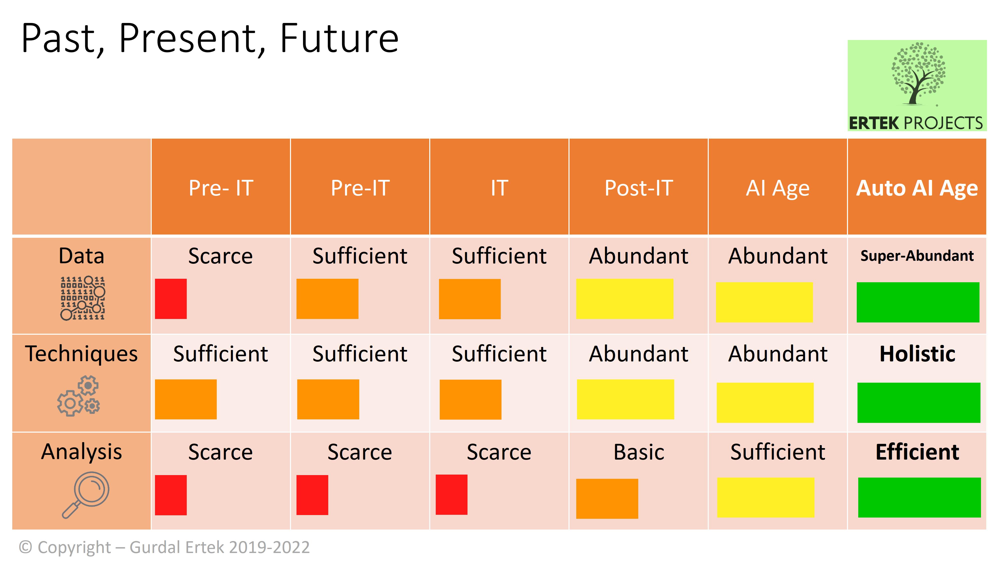
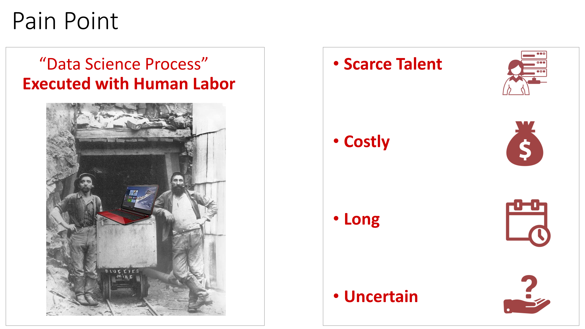
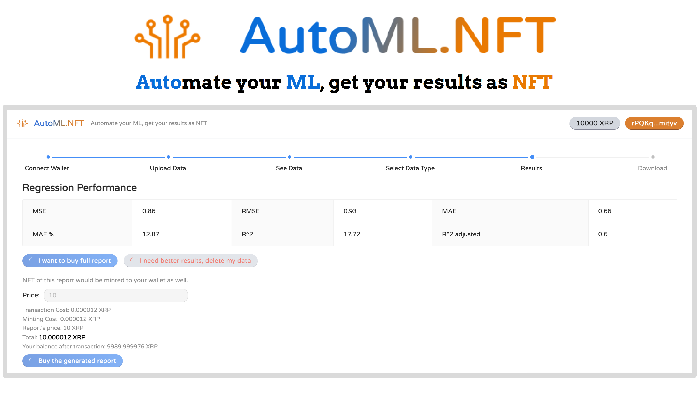
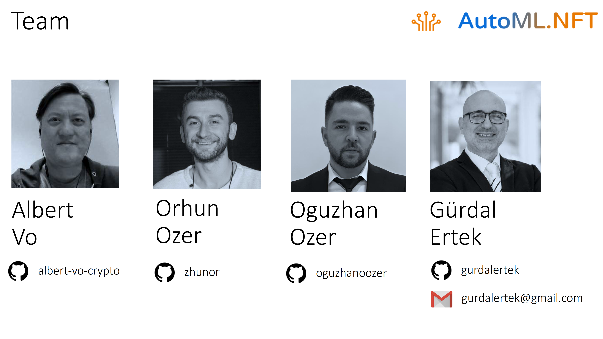

 

## Background

**Machine learning (ML)** is a type of artificial intelligence (AI) where machines **learn from data to discover insights, make predictions, and prescribe answers**. ML is essential to business, government, and other industries, even though its full potential has not been actualized. 

Many of top technology companies apply and thrive on ML: **Google** uses Natural Language Processing (NLP) to predict what terms and web content the user may be searching for; **Amazon** uses association mining to identify items that are searched and/or purchased together, to make cross-sale and up-sale recommendations to users; **Meta** analyzes huge amounts of personal data, collected from Facebook, WhatsApp, Instagram, and SnapChat, to show the most relevant content and advertisements to its customers.

The figure below shows the **past, present and future** of information technology (IT) and AI, with respect to availability of data, techniques, and level/nature of analyses. As of 2022, the state of IT and AI can be argued to be in the "Post-IT" stage, where there is abundant data and techniques, yet analysis is only basic. Over time, there will be tools to facilitate analysis, such that the level of analysis goes to sufficient and eventually becomes efficient.

 

As mentioned earlier, despite its huge potential, **ML has found only limited application in industry**. The main **pain point**, as shown below, is the amount of human involvement and manual operations in the application of ML within the data science process. In other words, the main pain point is requirement for extensive **human labor**. 

 

The **solution** to the pain point of intense human labor requirement is **Automated Machine Learning (AutoML)** and even **Automated Data Science (AutoDaS)**. 
- In **AutoML**, the running of ML is automated, with human involvement being minimized. For example, in a prediction use case, the "best" ML algorithm (the algorithm that robustly gives the best performance with respect to well-established metrics) and its parameters are determined automatically by the AutoML system, without the user having to select any set of algorithms or initial parameters. 
- In **AutoDaS**, not only the ML, but the complete data science process is automated, including the data validation, data cleaning, data augmentation, feature engineering, visual analytics, and many other steps.

There exist a multitude of **AutoML platforms**, most of which are available as cloud services, i.e., are **Machine Learning as a Service (MLaaS) platforms**. The following figure shows some the existing MLaaS AutoML platforms in the market. Theese platforms that provide excellent support to analysts in business, industry, and governemnt. Notable systems are shown in the figure below. 

 

Given the increase in the amount of data and the need to process and capitalize on data, AutoML has a promising future. Yet, there is another field of technology, specifically information technology, that has also big potential: Blockchain. While the mentioned platforms are excellent, we, as the developer team, **did _not_ encounter an AutoML or MLaaS platform that is designed with Web 3.0 in mind**. 

Our experience as the project team on data science and ML and ML platforms, having noticed this gap, motivated us to merge AutoML and Blockchain. To this end, **our team has developed AutoML.NFT**, the **first Web 3.0 AutoML dapp on the blockchain**, running in interaction with **XRP Ledger (XRPL)**.

 

Our team consists of professionals from varying backgrounds, united with the ethos of **creating value through innovation**.

 

**Index**

1. **Background**
2. [Unique Value Offerings](UniqueValueOfferings.md)
3. [Design Principles](DesignPrinciples.md)
4. [System Architecture](SystemArchitecture.md)
5. [Backend](Backend.md)
6. [Frontend](Frontend.md)
7. [Technology/Tool Stack](TechnologyStack.md)
8. [Related Projects](RelatedProjects.md)
9. [Other Resources](OtherResources.md)
10. [Future Plans](FuturePlans.md)

<hline></hline>

[Back to Main GitHub Page](../README.md) | [Back to Documentation Index Page](Documentation.md)
