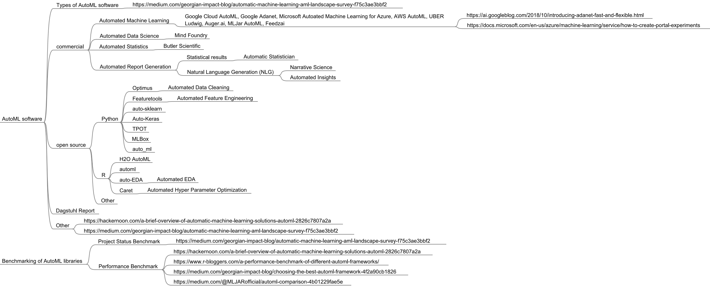

 

## Other Resources

**Other AutoML Tools**

The following are additional AutoML tools, which also include R packages and Python libraries:

 

**Index**

1. [Background](Background.md)
2. [Unique Value Offerings](UniqueValueOfferings.md)
3. [Design Principles](DesignPrinciples.md)
4. [System Architecture](SystemArchitecture.md)
5. [Backend](Backend.md)
6. [Frontend](Frontend.md)
7. [Technology/Tool Stack](TechnologyStack.md)
8. [Related Projects](RelatedProjects.md)
9. **Other Resources**
10. [Future Plans](FuturePlans.md)

<hline></hline>

[Back to Main GitHub Page](../README.md) | [Back to Documentation Index Page](Documentation.md)
