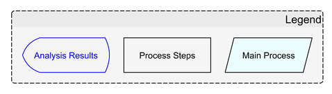
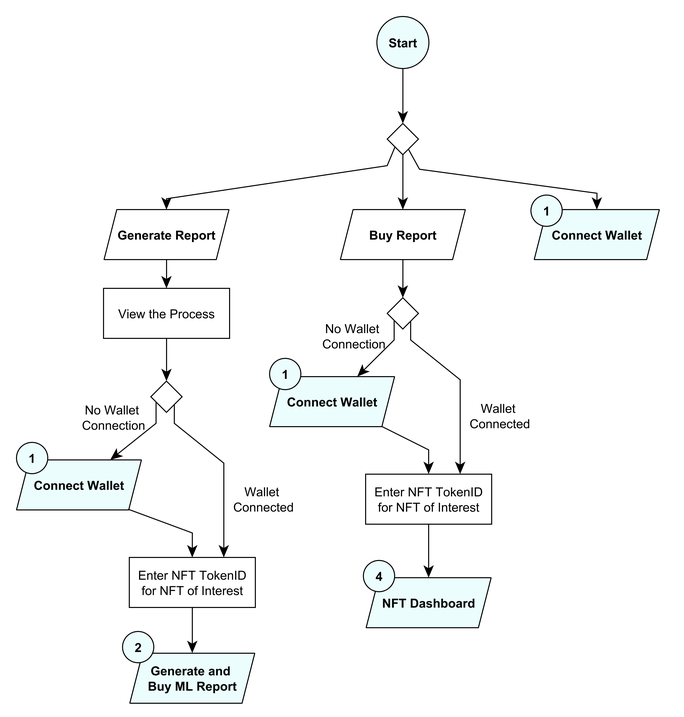
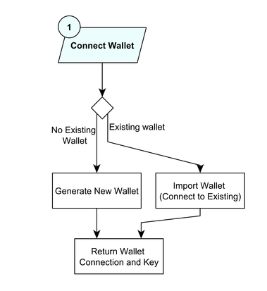
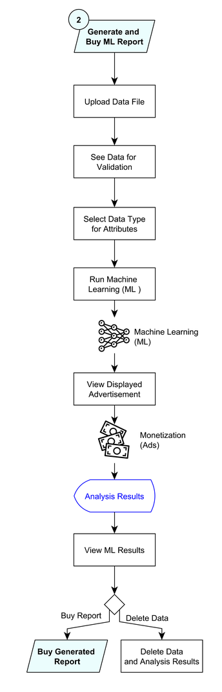
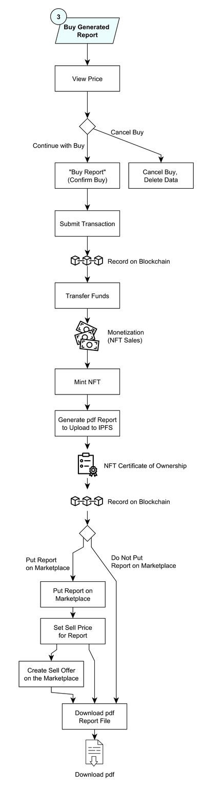
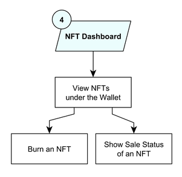

## System Architecture

The system architecture is illustrated in the following figures as a series of flow charts.

**Flowchart Symbols**

In the flowcharts, the following symbols are the main building blocks:

**Overall Process Flow**

**Connecting Wallet**

**Generating and Buying NFT Report**

**Buying Generated Report**

**NFT Dashboard and Buying from Marketplace**

**Index**

1. [Background](Background.md)
2. [Unique Value Offerings](UniqueValueOfferings.md)
3. [Design Principles](DesignPrinciples.md)
4. **System Architecture**
5. [Backend](Backend.md)
6. [Frontend](Frontend.md)
7. [Technology/Tool Stack](TechnologyStack.md)
8. [Related Projects](RelatedProjects.md)
9. [Other Resources](OtherResources.md)
10. [Future Plans](FuturePlans.md)

<hline></hline>

[Back to Main GitHub Page](../README.md) | [Back to Documentation Index Page](Documentation.md)
