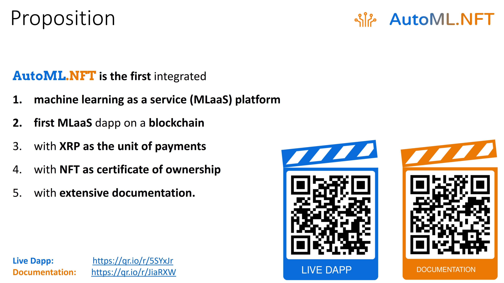
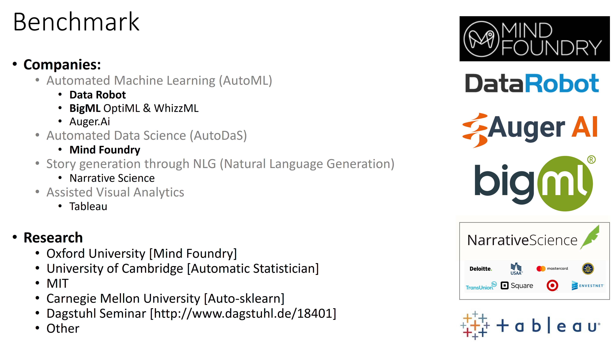

 

## Unique Value Offerings

AutoML.NFT brings the following value offerings to blockchain world, as well as industry and businesses around the world:

 

While there are multiple Machine Learning as a Service (MLaaS) and AutoML (Automated Machine Learning) platforms in the market, as shown below, AutoML.NFT is -to the best of our knowledge- the first platform to interact with a blockchain and offer an ML Reports Marketplace.

 

The most relevant benchmark to the project in the blockchain world is the [Ocean Market](https://market.oceanprotocol.com/), powered by [Ocean Protocol](https://oceanprotocol.com/), where practically anyone can upload a data, put it on sale, and profit from sales or staking. Besides putting data for sale, advanced users can also [set up and run their own marketplaces](https://oceanprotocol.com/build). AutoML.NFT differs from Ocean in that the focus of AutoML.NFT is the *analysis* of data and monetization of *analysis reports*, rather than the monetization of data itself as in Ocean Market. To this end, AutoML.NFT's proposition is a working implemented system that did not exist before.

**Index**

1. [Background](Background.md)
2. **Unique Value Offerings**
3. [Design Principles](DesignPrinciples.md)
4. [System Architecture](SystemArchitecture.md)
5. [Backend: Data under Moralis](Backend.md)
6. [Frontend: UI and Visual Analytics](Frontend.md)
7. [Technology/Tool Stack](TechnologyStack.md)
8. [Related Projects](RelatedProjects.md)
9. [Other Resources](OtherResources.md)
10. [Future Plans for Avalytics](FuturePlans.md)

<hline></hline>

[Back to Main GitHub Page](../README.md) | [Back to Documentation Index Page](Documentation.md)
